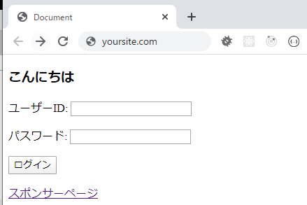

バーナーとかで外部サイトとの連携するのはよくあることだが、リンクを置くだけというとても簡単な作業なので、無意識のうち、脆弱性ができてしまうので、ここではポイントをまとめていきます。

## 問題

**a**タグで他サイトへ遷移する時に、遷移先のページでは元のページの`location`オブジェクトにアクセスができてしまい、\
悪質なアクションを行うことができる。

## 具体的どんなことが起こりえる

こんなシナリオを見て行きましょう

1. あなたのサイトに他サイト遷移のリンク配置
2. ユーザーはリンクをクリックして、新しいタブで開く
3. ユーザーはあなたのサイトのタブに戻る \

ここではさっぱり元のタブに戻って、あなたのサイトを見ているんだと思っているユーザは、悪質なページに切り替わったのです！

実際で試してみましょう

1. あなとのサイトへアクセスする\
   

2. **スポンサーページ**をクリックし、**○○株式会社**サイトへアクセスする\
   

3. **1**のタブに戻って、**ログイン**をする\
   

ここで変わった点を気づいたか

- リンクURL：**yoursite.com** -> **y0ursite.com**
- 画面がそっくりだね。（デモの目的でメッセージを出したけど）

## 対策

- **a**タグに **rel="noopener noreferrer"** 属性を追加

## まとめ

- 外部ページへアクセスするリンクは全て**rel="noopener noreferrer"**に設定すること
- 本脆弱性は自サイトの問題ではなく、連携先側で攻撃を受けられた際、悪影響を及ぼす対策の必要なものである。
